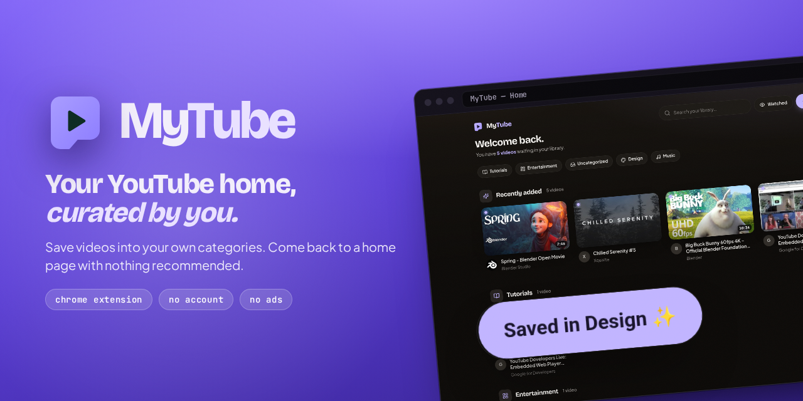
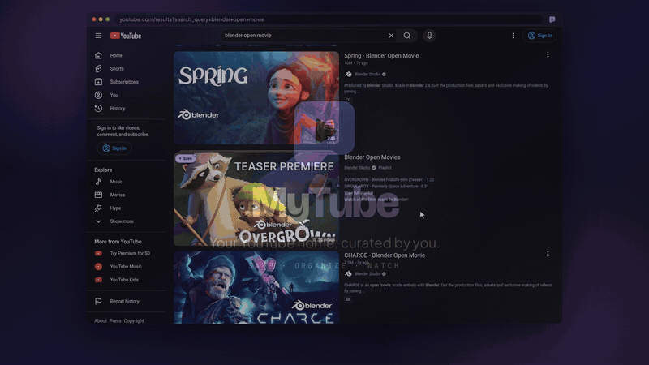
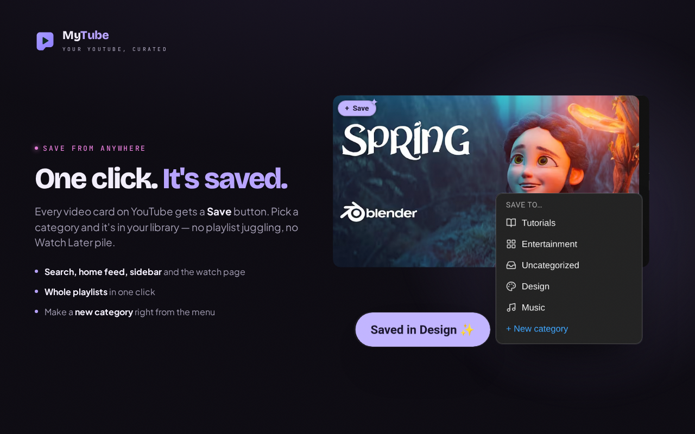
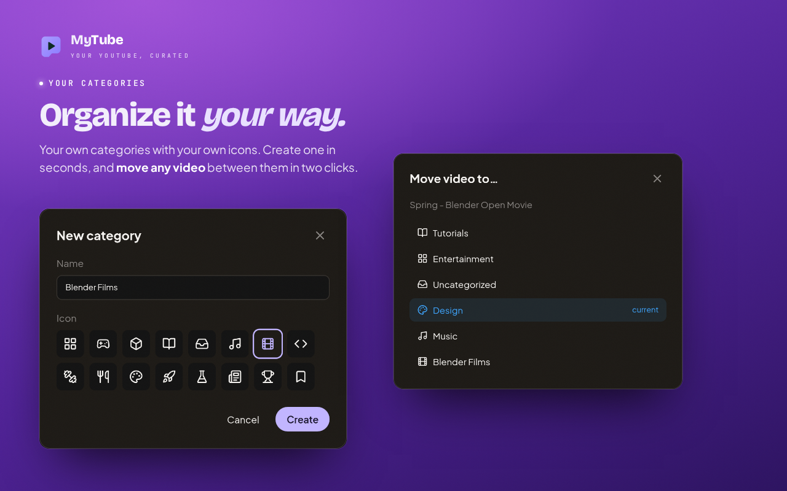
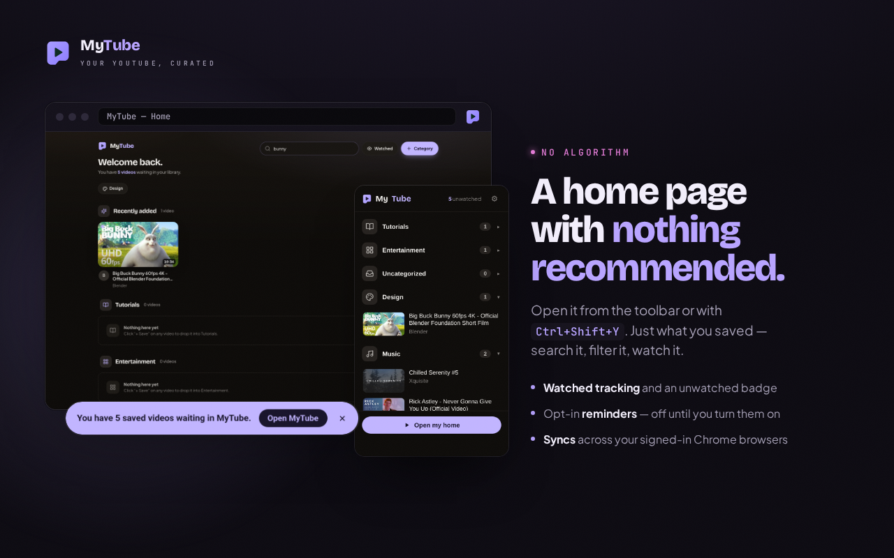
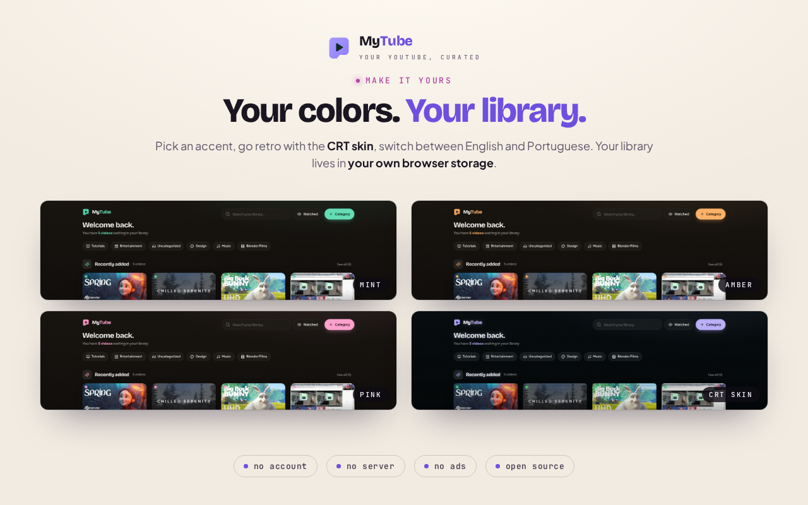

<p align="center">
  
</p>

<p align="center">
  <a href="https://chromewebstore.google.com/detail/mytube/bjfbghppgndaafpfjanjflpeigfmdlgj"></a>
</p>

<p align="center">
  <a href="https://chromewebstore.google.com/detail/mytube/bjfbghppgndaafpfjanjflpeigfmdlgj"></a>
  <a href="https://github.com/dankhael/mytube/actions/workflows/ci.yml"></a>
  
  
  
  <a href="LICENSE"></a>
</p>

**Watch Later became a graveyard.** MyTube is a Chrome extension that gives you a
YouTube home page you actually curate: save videos straight from YouTube into
**categories you define**, then come back to a clean library with nothing
recommended and nothing autoplaying.

<p align="center">
  
</p>

## A quick tour

<table>
  <tr>
    <td width="50%"></td>
    <td width="50%"></td>
  </tr>
  <tr>
    <td><b>Save from anywhere.</b> Every video card on YouTube gets a Save button: pick a category, or make a new one right from the menu.</td>
    <td><b>Organize it your way.</b> Your own categories with your own icons; move any video between them in two clicks.</td>
  </tr>
  <tr>
    <td></td>
    <td></td>
  </tr>
  <tr>
    <td><b>Nothing recommended.</b> Search and filter what you saved, from the home page or the toolbar popup.</td>
    <td><b>Make it yours.</b> Accent colors, a retro CRT skin, and English or Portuguese.</td>
  </tr>
</table>

## Features

- **Save from anywhere on YouTube.** A "+ Save" button on home-feed, search,
  channel and sidebar cards, a pill on the watch page, and an **Import** button
  on playlist pages that brings a whole playlist into a category in one go.
  Re-saving a video moves it instead of duplicating it.
- **A curated home.** A grid per category, plus smart sections: **Recently
  added**, and **Gathering dust** for unwatched videos older than 21 days.
  Category chips jump to a section, search filters by title or channel, and
  drag & drop reorders both videos and categories. Cards show the duration,
  the channel avatar, and a menu to move, mark watched, or remove.
- **The toolbar popup.** Your categories and videos at a glance, the unwatched
  count, and a shortcut to the home.
- **Watched tracking.** Mark videos watched; the toolbar badge shows how many
  are still waiting.
- **Optional reminders**, both off on a fresh install: open the home when the
  browser starts, or show a dismissible nudge on the YouTube home page.
- **Make it yours.** Six accent colors, the retro **CRT** skin, sound effects,
  and the interface in English or Portuguese (Brazil).
- **Syncs** across your signed-in Chrome browsers through `chrome.storage.sync`.

> **The home is not a new-tab override.** Overriding the new tab hijacks every
> tab and triggers Chrome's "keep this page?" prompt, so the home is a normal
> page you open on demand: from the toolbar popup, or with **Ctrl+Shift+Y**
> (**Cmd+Shift+Y** on Mac). See [src/home-page.ts](src/home-page.ts).

## Install

**From the Chrome Web Store** (recommended): [**MyTube on the Chrome Web Store**](https://chromewebstore.google.com/detail/mytube/bjfbghppgndaafpfjanjflpeigfmdlgj) → **Add to Chrome**.

**From source:**

1. `npm install && npm run build`
2. Open `chrome://extensions` and enable **Developer mode**
3. **Load unpacked** → select the **`dist/`** folder
4. Browse YouTube, click **"+ Save"** on a video, then open your home from the
   toolbar icon or with **Ctrl+Shift+Y**

## Privacy & permissions

MyTube asks for exactly `storage` plus access to `https://www.youtube.com/*`:
no `tabs`, no `history`. There is no server, no account, no ads and no
analytics. Your library lives in your own browser storage and never reaches the
developer.

The one request the extension makes on its own is a best-effort lookup to
YouTube's public oEmbed endpoint, to fill in a title or channel name it couldn't
read from the page. A failed lookup never blocks a save.

See [docs/PRIVACY.md](docs/PRIVACY.md) for the full policy, and
[specs/security-hardening.spec.md](specs/security-hardening.spec.md) for the
message-validation, CSP and least-privilege rules.

## Development

Built with Vite + [CRXJS](https://crxjs.dev/), React 18, TypeScript, Tailwind
CSS, Lucide icons and `@dnd-kit` for drag & drop.

```bash
npm install
npm run dev          # Vite with HMR — load dist/ in Chrome as above
npm run build        # tsc --noEmit && vite build → dist/
```

### Tests

```bash
npm test             # Vitest: reducer, content-script helpers, popup, home, tooling
npm run test:watch
npm run test:e2e     # Playwright: loads the built extension in headed Chromium
```

`npm run test:e2e` needs `npx playwright install chromium` once. CI runs
`npm test` and the build on every pull request.

### How the service worker is organized

The service worker owns storage and validates every message at the trust
boundary before it reaches the `MyTubeStore` reducer. The typed contract is the
`Message` union and the `StorageData` schema in [src/types.ts](src/types.ts);
tests inject a fake storage backend, so they never need a Chrome runtime.

## Store & promo assets

Every image and video of the extension is generated from the **real packaged
extension**, driven by Playwright, so it stays in sync with the UI:

| Command | Produces |
|---|---|
| `npm run store:promo` | Designed store listing images, in English and Portuguese ([`docs/store-assets/listing/`](docs/store-assets/listing/)); the YouTube thumbnail and the Shorts cover ([`docs/promo-video/`](docs/promo-video/)); the support-form header; this README's banner |
| `npm run promo:video` | The promo video, landscape 1080p and vertical 1080×1920, silent so music and narration can be added ([`docs/promo-video/NARRATION.md`](docs/promo-video/NARRATION.md)) |
| `node scripts/make-promo-video.mjs gif` | This README's demo GIF, cut from the 1080p video |
| `npm run store:assets` | Raw UI screenshots of every surface ([`docs/store-assets/`](docs/store-assets/)) |

## Localization

Interface text lives in one catalog, [src/i18n.ts](src/i18n.ts), keyed by the
saved language setting, so you can switch language without changing your browser
locale. English is the default; Portuguese (Brazil) is picked automatically on a
Portuguese browser and can be switched in Settings.

The store-facing manifest strings live separately in [`_locales/`](_locales/)
and follow the **browser** language, which is what the Chrome Web Store and
`chrome://extensions` display.

## Contributing

Work is spec-first for anything beyond a trivial fix. Each feature owns one
`specs/<feature>.spec.md` with a table of stable, observable acceptance criteria
(`SAVE-3`, `DUR-1`, …), and every criterion is bound to a test named after its
ID, so grepping an ID shows spec ↔ test in one shot.

- [specs/WORKFLOW.md](specs/WORKFLOW.md): the tiered process, step by step
- [specs/CAPABILITIES.md](specs/CAPABILITIES.md): a living index of what the
  extension does today
- [CLAUDE.md](CLAUDE.md): code style and conventions

`openspec/` is frozen, read-only history; new behavior is specced only in
`specs/*.spec.md`.

## Publishing

[docs/chrome-web-store-submission.md](docs/chrome-web-store-submission.md) holds
the listing copy (English and Portuguese), the permission justifications, and
the packaging checklist for the Chrome Web Store.

## Roadmap

- Export and back up your library
- Default category names in the interface language (today they start in English)

## License

[MIT](LICENSE) © Danilo Mikhael da Silva Melo

---

<sub>MyTube is an independent project, not affiliated with, sponsored by, or endorsed by YouTube or Google LLC. YouTube is a trademark of Google LLC.</sub>
